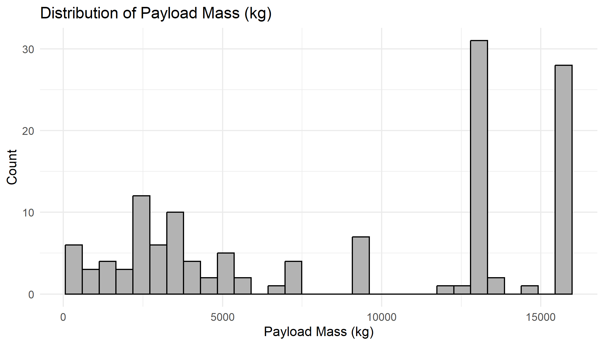
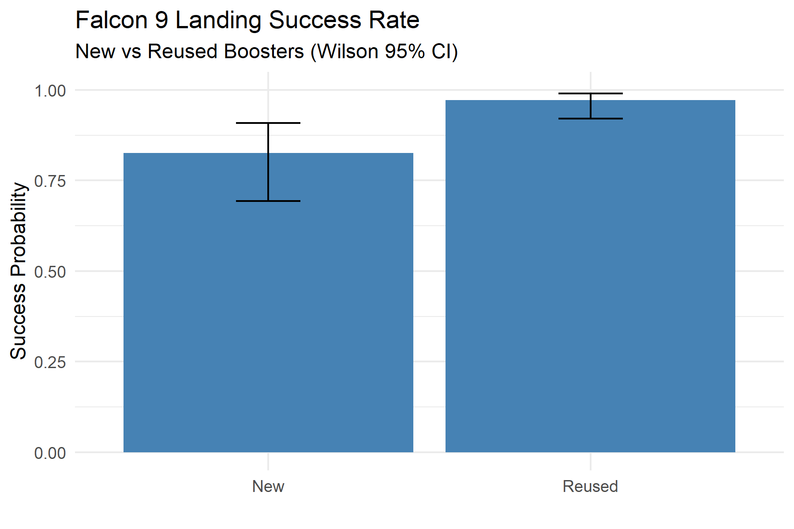
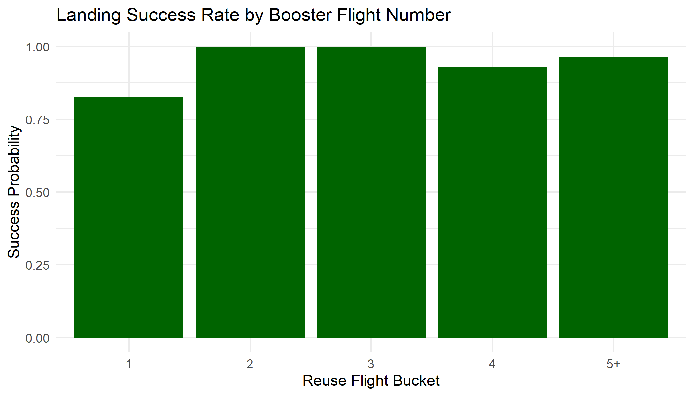
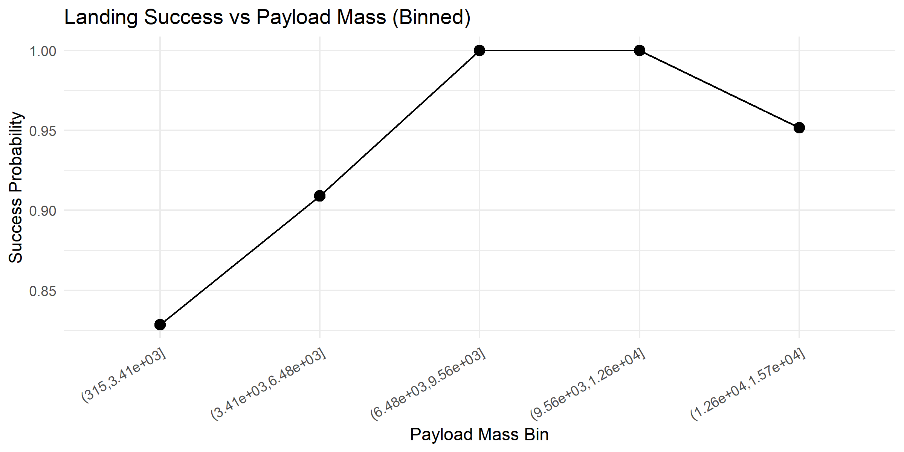
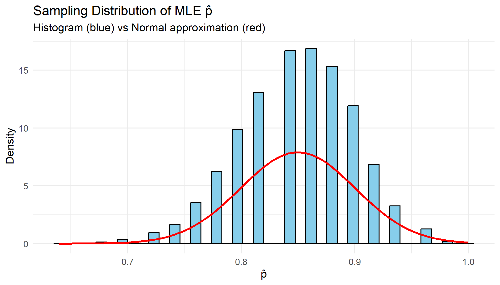
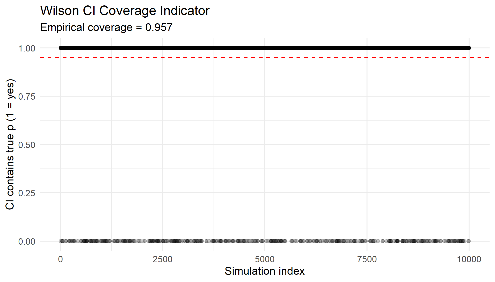
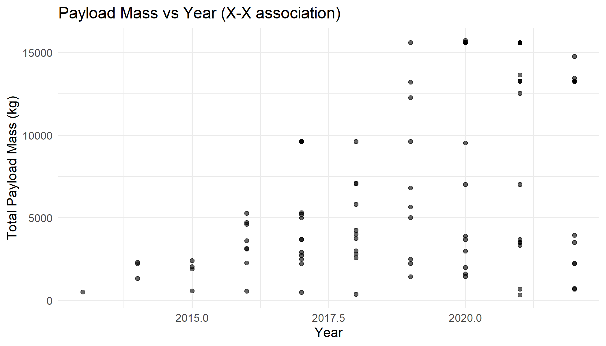

# Falcon 9 Reuse vs Landing Reliability  
Probability & Statistics Final Project

## 1. Data description
**Data source.** Public SpaceX API (v4): `api.spacexdata.com`. Falcon 9 launches are queried and landing outcomes are extracted from the launch `cores` field (first-stage core landing attempt and success). Payload masses are obtained by populating `payloads` and summing `mass_kg`.

**Dataset size.** The clean landing-attempt dataset contains **153** Falcon 9 launches (each with exactly one landing-attempt core).

**Variables and types.** A structured variable table is exported to `output/variables_table.md`.  
Outcome variable: **`landing_success`** (0/1).  
Key predictors: **`is_reused`** (new vs reused), **`reuse_flight`** / **`reuse_bucket`** (reuse amount), **`payload_mass_kg_total`**, **`year`**.

**Reproducibility.** All cleaning and analysis are code-driven. The final analysis table is saved as `data/clean_f9_landings.csv`.

---

## 2. Goal of analysis and statistical hypotheses
### Primary question
For Falcon 9 launches that attempted a landing, is the landing success probability different for **new** boosters vs **reused** boosters?

Let `Y = 1` if landing succeeded and `Y = 0` otherwise. Define groups by booster flight number:
- **New** if `reuse_flight = 1`
- **Reused** if `reuse_flight >= 2`

Hypotheses:
- $H_0: p_{\text{new}} = p_{\text{reused}}$
- $H_1: p_{\text{new}} \ne p_{\text{reused}}$

### Secondary question (reuse amount)
Does landing success differ across reuse levels (flight buckets 1,2,3,4,5+)?

---

## 3. Descriptive statistics and outliers
Descriptive statistics are computed in `output/descriptive_stats.txt`, including:
- landing success rates by new vs reused
- landing success rates by reuse buckets (1,2,3,4,5+)
- payload mass distribution and outlier detection

**Outliers (payload mass):** The 1.5×IQR rule is applied to `payload_mass_kg_total` (ignoring missing values). The computed quartiles, IQR, and outlier count are reported in `output/descriptive_stats.txt`.

---

## 4. Graphical statistics
All figures are generated by `src/04_descriptives_and_plots.R` and `src/04b_extra_descriptives_assoc.R` and saved in `figs/`.

### Figure 1 — Payload mass distribution


### Figure 2 — Landing success: New vs Reused (Wilson 95% CI)


### Figure 3 — Landing success by reuse bucket (1,2,3,4,5+)


### Figure 4 — Landing success vs payload mass (binned)


### Figure 5 — Monte Carlo: sampling distribution of $\hat p$ (MLE) vs Normal approximation


### Figure 6 — Monte Carlo: Wilson CI coverage indicator


### Figure 7 — Payload vs Year


---

## 5. Associations between variables
We examine associations:
- between reuse amount (`reuse_bucket` / `reuse_flight`) and landing success (`landing_success`)
- between payload mass (`payload_mass_kg_total`) and landing success (via binned success-rate plot)
- temporal patterns via `year` (used later in robustness modeling)

---

## 6. Model description and estimation method
### 6.1 Bernoulli/Binomial framework (analytical component)
For landing attempts, we model each outcome as:
- $Y_i \sim \text{Bernoulli}(p)$

For a sample of size $n$, the total number of successes $X=\sum_{i=1}^{n} Y_i$ follows:
- $X \sim \text{Binomial}(n,p)$

**MLE derivation.** The Binomial likelihood is:
- $L(p) = \binom{n}{X}\, p^X (1-p)^{n-X}$

Maximizing $L(p)$ yields the maximum likelihood estimator:
- $\hat p_{\text{MLE}} = X/n$

Properties:
- Unbiasedness: $E[\hat p]=p$
- Variance: $\mathrm{Var}(\hat p)=\dfrac{p(1-p)}{n}$

### 6.2 Two-sample inference for proportions (new vs reused)
To compare new vs reused, we test equality of two proportions and report confidence intervals. Because some failure counts are small in the reused group, Fisher’s exact test is also used as a robust alternative to large-sample approximations.

### 6.3 Logistic regression (binomial GLM) for robustness
To control for potential confounding by time and payload mass, we fit logistic regression models:

- Model A: `landing_success ~ is_reused + payload_tons + year_c`
- Model B: `landing_success ~ reuse_flight + payload_tons + year_c`

where:
- `payload_tons = payload_mass_kg_total / 1000`
- `year_c = year - median(year)`

Estimation is performed via maximum likelihood (numerical optimization), as standard for logistic regression.

---

## 7. Results of fitted models (estimates, CI, p-values)
All numerical results are saved to:
- `output/inference_results.txt`
- `output/model_summary.txt`

A concise summary is exported to:
- `output/key_results.md`

### 7.1 Primary result: New vs Reused
From the clean dataset ($n=153$):
- New boosters: **38/46** successes ($\hat p = 0.8261$), Wilson 95% CI **[0.6928, 0.9091]**
- Reused boosters: **104/107** successes ($\hat p = 0.9720$), Wilson 95% CI **[0.9208, 0.9904]**
- Difference (Reused − New): **0.1459**
- Continuity-corrected odds ratio (Reused vs New): **OR ≈ 6.59**

Hypothesis testing:
- Two-proportion test (approx): p-value = **0.00136** (approximation warning may occur due to small failure counts)
- Fisher exact test (recommended here): p-value = **0.00314**

### 7.2 Reuse amount (bucket association)
Contingency testing across reuse buckets (1,2,3,4,5+) indicates a statistically significant association:
- Fisher test with simulated p-value: p-value ≈ **0.03899**

The contingency table is available in `output/inference_results.txt`.

### 7.3 Robustness: logistic regression controlling for payload mass and time
Using launches with non-missing payload mass ($n=133$):
- Model A (`is_reused + payload + year`): `is_reused` is **not** statistically significant (p≈0.6407), while `year_c` **is** significant (p≈0.0106).
- Model B (`reuse_flight + payload + year`): `reuse_flight` is **not** significant (p≈0.8369), while `year_c` **is** significant (p≈0.00588).

Full coefficient tables and odds ratios are in `output/model_summary.txt`.

---

## 8. Interpretation in the context of the hypothesis
**Primary comparison:** In this dataset, the raw landing success rate is higher for reused boosters than for new boosters, and the difference is statistically significant by Fisher’s exact test.

**However,** when controlling for **year** and **payload mass** in logistic regression, reuse indicators (`is_reused` or `reuse_flight`) are not statistically significant while the year effect remains significant. A plausible interpretation is that landing reliability improved over time due to operational and engineering learning, and reused boosters are disproportionately represented in later years when baseline landing success is higher. Therefore, the raw association should not be interpreted as “reuse causes higher reliability,” but rather as an association that is largely explained by temporal improvement.

---

## 9. Programming code (reproducible, commented)
All scripts are in `src/` and run in sequence. To reproduce all outputs from scratch:

```r
source("run_all.R")
```

Key scripts:

* `src/01_setup_and_get_falcon9_id.R`
* `src/02_download_raw_launches.R`
* `src/03_build_clean_dataset.R`
* `src/04_descriptives_and_plots.R`
* `src/04b_extra_descriptives_assoc.R`
* `src/05_simulation_mle_ci.R`
* `src/06_inference_real_data.R`
* `src/07_export_report_snippets.R`

---

## 10. Submitted data

* Raw query response: `data/raw_f9_launches_query_response.json`
* Clean dataset used in analysis: `data/clean_f9_landings.csv`

All results and figures are reproducible from these files and the codebase.
